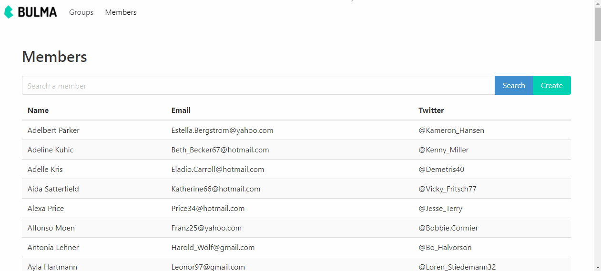

# Groepenbeheer (English version below)

Een sportclub beschikt over een tool om hun leden in te delen in groepen, het is aan jou om deze functionaliteiten verder te vervolledigen.

## Domain

Het domein is relatief eenvoudig. Er worden slechts 2 klassen opgeslagen in de databank, namelijk `Group` en `Member`. Je mag tijdens het examen geen visibiliteit van de properties aanpassen. Elk lid wordt toegekend aan een groep en een groep weet ook dewelke zijn leden zijn.

## Puntenverdeling

De punten staan naast de vragen. Indien je solution niet compileert (0/20), code in commentaar wordt niet bekeken.

## Functionaliteiten

Er zijn twee primaire functionaliteiten die je dient te implementeren:

* het opzoeken van leden;
* en het toevoegen van leden.

Meer hierover later.

## Packages

Alle packages zitten reeds in de projecten. Je dient geen extra packages via NuGet toe te voegen, mogelijks wel te gebruiken of te implementeren.

## Vraag 1 - Domein (10)

Een `Member` kan toegevoegd worden aan een `Group`. Zorg dat volgende unit testen slagen.

* `Group_Should.Have_one_member_after_adding_member`
* `Group_Should.Cannot_add_duplicate_member`
* `Group_Should.Cannot_add_invalid_member`

> Wijzig niets aan setters, getter of parameters. Implementeer alleen de methode `Group.AddMember` op basis van de testen.

## Vraag 2 - Unit test (10)

Wanneer de `name` parameter van de `Group` constructor niet ingevuld is, zou de methode een `ArgumentException` moeten gooien. Valideer dit door de theoretische test `Group_Should.Cannot_be_created_with_invalid_name` te implementeren **en** te laten slagen door een `Guard` clausule van het Ardalis package te gebruiken in de `Group` constructor.

## Vraag 3 - Configurations (10)

In de databank zijn er nog enkele problemen die opgelost moeten worden door de `MemberConfiguration` en `GroupConfiguration` correct te implementeren.

Nu negeert EF de naam van een lid, zorg ervoor dat de `Name` opgeslagen wordt in de databank. De naam moet opgeslagen worden in twee kolommen met als naam `FirstName` and `LastName`. Beide zijn verplicht en hebben een maximum lengte van 100 karakters.

In de `GroupConfiguration` moet je er nog voor zorgen dat de leden van een groep verwijderd worden als het lid verwijderd wordt. Een lid kan niet bestaan zonder gelinkte groep.

## Vraag 4 - Authenticatie (10)

De create knop bovenaan de pagina `Members.Index.razor` mag enkel zichtbaar zijn voor `Administrator`s. **Daarnaast** mogen enkel `Administrator`s de `Members.Create.razor` pagina zien.

> Je hoeft je geen zorgen te maken dat de API call niet afgeschermd is voor deze vraag, we gebruiken de `FakeAuthenticationProvider`.

## Vraag 5 - Filter (20)

Momenteel worden de leden opgehaald zonder enige filterfunctionaliteit in de Index pagina. Implementeer de filterfunctionaliteit zodat wanneer op de zoekknop wordt geklikt, een oproep naar de server wordt uitgevoerd en een lijst van leden wordt teruggestuurd op basis van de zoekterm in de filter. De aanroep wordt alleen getriggerd bij het klikken op de knop (Search), niet bij het typen of verliezen van de focus.

Gebruik de `MemberService.GetIndexAsync` methods om het filtergedrag te implementeren. Merk op dat filteren zelf in de databank moet gebeuren en niet in de back-end / front-end. Alleen de leden waarvan de voor- of achternaam de zoekterm bevatten worden geretourneerd in alfabetische volgorde op basis van voornaam en dan achternaam.

### Eindresultaat - Zoeken naar leden

## Vraag 6 - Create (20)

Het aanmaken van leden is niet zo functioneel, het is enkel gestyled met BULMA, hergebruik deze elementen. Implementeer het toevoegformulier met behulp van `MemberRequest.Create`, `MemberDto.Mutate`, `Members.Create.razor` and `MemberService.CreateAsync` (reeds geïmplementeerd) (back- / front-end). Gebruik een `EditForm` met `FluentValidation` om er zeker van te zijn dat er geen ongeldige leden kunnen worden aangemaakt, controleer de databankregels en maak ze consistent (regels in de databank gelden ook voor de validatie). De `Validator` is een nested class binnen de `MemberDto.Mutate`.

Daarnaast dien je ook de Server / API te beschermen tegen ongeldige materialen. Doe dit ook aan de hand van het `FluentValidation.AspNetCore` package en middleware.

> Je hoeft geen extra eigenschappen toe te voegen aan de `MemberDto.Mutate`.

## Vraag 7 - Notifications (10)

Wanneer een lid is aangemaakt, wordt de gebruiker terug genavigeerd naar de `Members.Index.razor` pagina en moet een notificatie getoond worden. Gebruik [Blazored.Toast](https://github.com/Blazored/Toast) om een success notificatie te tonen: "&lt;FirstName&gt; &lt;LastName&gt; was added!". Gebruik the README.md van het project om deze functionaliteit te implementeren. Vervang &lt;FirstName&gt; and &lt;LastName&gt; door de voor- en achternaam van het nieuwe lid.

### End result - Creating members with validation and notifications

## Vraag 8 - Theorie (10)

Beantwoord de volgende vragen in-line in deze README.md:

1. Waarom zou je het `Id` van de abstracte klasse `Entity` `virtual` maken?
    - Antwoord:

2. Wat is het verschil tussen singleton, scoped en transient services? Hoe komt dit naar voor in Blazor WASM versus Blazor Server?
    - Antwoord:

---

> English version

# Group management

A sportclub has a tool to organize their members in certain groups, it's your job to complete this functionality.

## Domain

The domain is pretty easy. There are only 2 classes in the database, namely `Group` and `Member`. You are not allowed to change visibility of properties during the exam. Each member is assigned to a group and each group knows his members.

## Features

There are only two features which you need to implement:

- Searching for members
- Creating new members

More on this later.

## Packages

All necessary packages are installed in each project, you are not allowed to install extra NuGet packages. It may happen that you need to use or implement these packages.

## Question 1 - Domain (10)

A `Member` can be added to a `Group`. Make the following unit tests pass:

* `Group_Should.Have_one_member_after_adding_member`
* `Group_Should.Cannot_add_duplicate_member`
* `Group_Should.Cannot_add_invalid_member`

> Do not alter setters, getters or parameters, only implement the method `Group.AddMember` based on the tests.

## Question 2 - Unit testing (10)

When the `name` parameter in the `Group` constructor is not filled in, the method should throw an `ArgumentException`. Validate this by implementing the theoretical test `Group_Should.Cannot_be_created_with_invalid_name` **and** by letting the test pass using a `Guard` clausule from the Ardalis package in the `Group` constructor.

## Question 3 - Configurations (10)

In the database, there are still some issues that need to be resolved using the `MemberConfiguration` and `GroupConfiguration`.

At this moment EF ignores the member's name, make sure the `Name` is stored in the database. The name should be stored in two columns with names `FirstName` and `LastName`. Both are required and have a max length of 100.

When it comes down to `GroupConfiguration`, the members of a group should be deleted when their group is removed. Make sure a member cannot exist without a linked group.

## Question 4 - Authentication (10)

The create button on top of the `Members.Index.razor` page should only be available to `Administrator`s. **Also** make sure the `Members.Create.razor` page can only be accessed by `Administrator`s.

> You do not have to worry about the API call not being protected for this question, since we're using the `FakeAuthenticationProvider`.

## Question 5 - Filter (20)

Currently the members are being fetched without any filter functionality. Implement the filter functionality so that when clicking on the search button, a call to the server is made and a list of members is returned based on the searchterm in the filter (input). The call is only triggered when clicking the button, not while typing or losing focus.

Use the `MemberService.GetIndexAsync` method to implement the filter behavior. Note that the filtering itself should be done in the database and not in the back-end / front-end. Only the members with a first or last name that contains the searchterm are returned in an alphabetical order based on the first name and then the last name.

### End result - Searching for members

## Question 6 - Create (20)

The create form is currently not very functional, it is however styled using BULMA, re-use these styles. Implement the Create form using the `MemberRequest.Create`, `MemberDto.Mutate`, `Members.Create.razor` and `MemberService.CreateAsync` (already implemented) (back- / front-end). Use an `EditForm` with `FluentValidation` to make sure no invalid members can be created, check the database rules and make them compliant (rules in the database also apply for validation). The Validator class is a nested class within the `MemberDto.Mutate`. Fetch the groups for the `InputSelect` using `GroupService.GetIndexAsync` (Client).

Then you also need to protect the Server / API against invalid members. Use the `FluentValidation.AspNetCore` package and middleware to achieve this.

> You don't need to add extra properties to the `MemberDto.Mutate`.

## Question 7 - Notifications

When a member is created and the user is navigated back to the `Members.Index.razor` page a notification should be shown to the user. Use [Blazored.Toast](https://github.com/Blazored/Toast) to show a success notififcation "&lt;FirstName&gt; &lt;LastName&gt; was added!". Use the README.md of the project to implement the functionality. Replace &lt;FirstName&gt; and &lt;LastName&gt; with the first and last name of the newly created member.

### End result - Creating members with validation and notifications

## Question 8 - Theory (10)

1. Why would one allow the `Id` of an abstract `Entity` class to be `virtual`?
    - Answer:

2. What's the difference between singleton, scoped and transient services? How do these apply in Blazor WASM versus Blazor Server?
    - Answer: